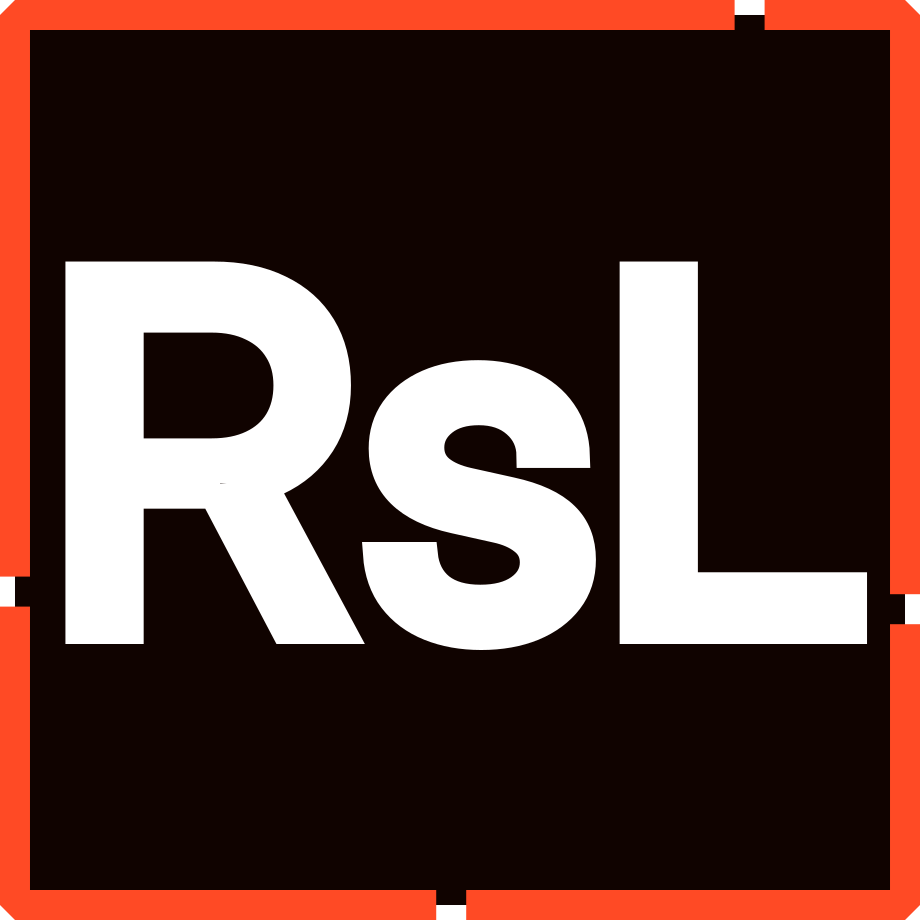
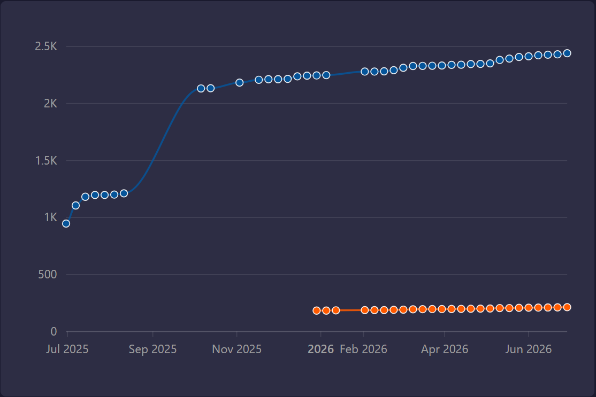

#
<div align="center">
	
	<h1>Red Sea Markup Language</h1>
</div>
<div align="center">
	<a href="https://www.nuget.org/packages/OceanApocalypseStudios.RSML" target="_blank"></a>
	
	
	<br/><br/>
	<a href="https://github.com/OceanApocalypseStudios/RedSeaMarkupLanguage/releases/latest"></a>
	
	
	<a href="LICENSE.txt"></a>
	
	
	<br/>
	
</div>
<hr/>
<div align="center">
<strong style="font-size: small">
An OceanApocalypseStudios project,
</strong>
<p>
the modern language designed to dynamically interpret different logic paths based on an host's OS and CPU architecture.
</p>
</div>

---

## Contents
- [Red Sea Markup Language (RSML)](#section)
	- [Why RSML?](#why-rsml)
	- [How to build RSML?](#how-to-build-rsml)
	- [Performance Analysis](#performance-analysis)
	- [Supported Editors](#supported-editors)
	- [Supported Programming Languages](#supported-programming-languages)

<details open>
<summary><strong>Where's the "How to use" section?</strong></summary>

This file does not attempt to be a full documentation on how to use RSML.
Instead, you can find full documentation [here](https://oceanapocalypsestudios.org/rsml-docs/).

</details>

<details open>
<summary><strong>How can I see what is being worked on in RSML?</strong></summary>

You can find the official bug tracker and
roadmap [here](https://github.com/orgs/OceanApocalypseStudios/projects/6/views/2).

</details>

---

## Why RSML?
**Red Sea Markup Language** is **the** powerful and robust fork of [MF's CrossRoad Solution](https://mf366-dev.github.io/documentation/mfroad/mfroad_1.0.html), a language designed to **dynamically interpret different logic paths based on the local host OS and CPU architecture**.

RSML, which is short for Red Sea Markup Language, is still in development, but the finished v3.0.0 will observe the following core features:

- A complete toolchain featuring buffers, readers, lexers, parsers and evaluators.
- The core library available in C#, Visual Basic, Python and many other languages.
- SDK for convenience and a more idiomatic usage of RSML in C#.
- A native shared library for those using RSML in C, C++ or languages that don't have official bindings.
- A CLI for interacting with the RSML toolchain easily.
- A static website for evaluating RSML on the go.
- First-class support for Visual Studio.
- Syntax highlighting for Visual Studio Code, JetBrains IDEs, Notepad++ and more.

RSML solves the issue of resolving logic paths dynamically based on a given host's characteristics.
When assigned an host, which could be the local host, RSML solves the logic paths and returns the first match's
associated value.
The important part here is to note RSML does this dynamically: if you were to switch hosts or pass different data, RSML
would adapt accordingly.

**Still unsure about RSML?** You can find some usage examples [here](#examples).

---

## How to build RSML?
<details>
	<summary><strong>Debug build</strong></summary>

1. Install the [.NET SDK 10.0](https://dotnet.microsoft.com/download).
2. Clone [this repository](https://github.com/OceanApocalypseStudios/RedSeaMarkupLanguage).
3. Open the terminal in the root RSML directory (the one with the solution file).

```
dotnet build -c Debug RedSeaMarkupLanguage.slnx
./src/RSML.CLI/bin/Debug/net10.0/RSML.CLI.exe
```

</details>

<details>
	<summary><strong>Optimized build</strong></summary>

1. Install the [.NET SDK 10.0](https://dotnet.microsoft.com/download).
2. Clone [this repository](https://github.com/OceanApocalypseStudios/RedSeaMarkupLanguage).
3. Open the terminal in the root RSML directory (the one with the solution file).

```
dotnet build -c Release RedSeaMarkupLanguage.slnx
./src/RSML.CLI/bin/Release/net10.0/RSML.CLI.exe
```

</details>
<details open>
	<summary><strong>CLI Framework-dependent Build</strong> <em>(good if you want a lighter CLI that uses your installed .NET SDK)</em></summary>

1. Install the [.NET SDK 10.0](https://dotnet.microsoft.com/download).
2. Clone [this repository](https://github.com/OceanApocalypseStudios/RedSeaMarkupLanguage).
3. Open the terminal in the root RSML directory (the one with the solution file).

```
dotnet publish -c Release -r <rid> src/RSML.CLI/RSML.CLI.csproj --no-self-contained true
```
</details>
<details open>
	<summary><strong>Native build</strong> <em>(compiles into a shared library)</em></summary>

1. Install the [.NET SDK 10.0](https://dotnet.microsoft.com/download).
2. Clone [this repository](https://github.com/OceanApocalypseStudios/RedSeaMarkupLanguage).
3. Open the terminal in the root RSML directory (the one with the solution file).

```
dotnet publish -c Release -r <rid> src/RSML.Native/RSML.Native.csproj
```

Once that is complete, the DLL will be located at
`src/RSML.Native/bin/<arch>/Release/net10.0/<rid>/publish/RSML.Native.dll`. The XML files in the same directory are
purely for documentation purposes and the `.pdb` file only matters for debugging.

</details>

---

## Performance Analysis
We analyse performance to see what can be improved for general user experience. We use [BenchmarkDotNet](https://benchmarkdotnet.org), a reputable benchmarking framework for .NET code.

More data on performance coming soon.

---

## Supported Editors
RSML is supported in **Visual Studio** and **Visual Studio Code** via extensions.
Support for more code editors and IDEs is also part of our RSML roadmap!

For more information, see:  <a href="docs/tools/editor-support/list.md">Editor Support</a>.

---

## Supported Programming Languages
As of now, you can only use RSML's API in **.NET** languages, such as **C#** (recommended for maximum support), **Visual Basic** and **F#**.
Support for more programming languages, such as Python, is also part of our RSML roadmap!

For more information, see:  <a href="docs/bindings/list.md">Programming Language Support</a>.

---

## RSML on NuGet Trends
> [!NOTE]
> In the image below, **RSML** refers to Legacy RSML (RSML v1.x.x), while **OceanApocalypseStudios.RSML** refers to
> Modern RSML (RSML v2.0.0).
> In any other context, RSML and OceanApocalypseStudios.RSML have the exact same meaning.

[](https://nugettrends.com/packages?ids=RSML&ids=OceanApocalypseStudios.RSML&months=12)


> **Copyright 2025-2026 OceanApocalypseStudios**
>
> We :heart: open-source!
