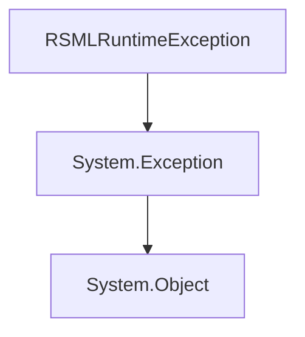

# `#!c# RSML.Exceptions.RSMLRuntimeException` Class
Exception that is thrown by the RSML document.

<!-- HIERARCHY -->

## Hierarchy

---

<!-- CONSTRUCTORS -->

## Constructors
`RSMLRuntimeException` contains 3 constructor methods.

<!-- 1 -->

### `#!c# RSMLRuntimeException()`
Initializes a new instance of the `RSMLRuntimeException` class.

<!-- 2 -->

### `#!c# RSMLRuntimeException(System.String message)`
Initializes a new instance of the `RSMLRuntimeException` class with a specified error message.

#### Parameters
`#!c# System.String message`

:   The message that describes the error.

<!-- 3 -->

### `#!c# RSMLRuntimeException(System.String? message, Exception? innerException)`
Initializes a new instance of the `RSMLRuntimeException` class with a specified error message and a reference to the error that caused this exception.

#### Parameters
`#!c# System.String? message`

:   The message that describes the error.

`#!c# Exception? innerException`

:   The exception that's the cause of the current exception
