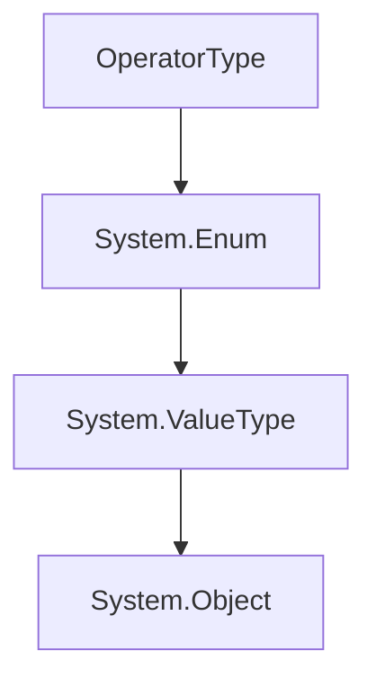

# `RSML.Parser.OperatorType` Enum
The RSML operator type.

<!-- HIERARCHY -->

## Hierarchy

---

<!-- VALUES -->

## Enum Values

|     Name     |                                      Description                                      |   Value   |
| ------------ | ------------------------------------------------------------------------------------- | --------- |
| `Primary`    | The primary operator. Its action cannot be redefined, but the operator itself can.    | `#!c# 0`  |
| `Secondary`  | The secondary operator.                                                               | `#!c# 1`  |
| `Tertiary`   | The tertiary operator.                                                                | `#!c# 2`  |
