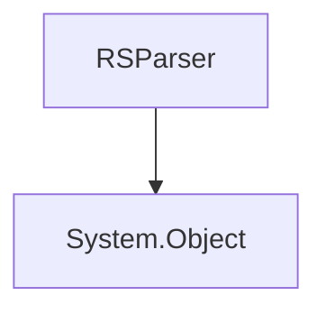

# `#!c# RSML.Parser.RSParser` Class
The default parser for Red Sea Markup Language.

<!-- HIERARCHY -->

## Hierarchy

---

<!-- CONSTRUCTORS -->

## Constructors
`RSParser` contains 4 constructor methods.

<!-- 1 -->

### `#!c# RSParser(System.String rsmlContents)`
Create a new parser instance from a RSML `System.String`.

#### Parameters
`#!c# System.String rsmlContents`

:   The RSML data to load, in the form of a `#!c# System.String`.

<!-- 2 -->

### `#!c# RSParser(StringReader rsmlReader)`
Create a new parser instance from a `#!c# StringReader` containing RSML.

#### Parameters
`#!c# StringReader rsmlReader`

:   The reader containing RSML.

<!-- 3 -->

### `#!c# RSParser(RSParser parser)`
Creates a new parser from another one's data.

#### Parameters
`#!c# RSParser parser`

:   An instance of a Red Sea Markup Language parser.

### `#!c# RSParser(RSDocument document)`
Creates a new parser from a document, but does not make changes to the document or to the document's linked parser.

#### Parameters
[`#!c# RSDocument document`](../RSML/RSDocument.md)

:   The document whose RSML to load.

<!-- INSTANCE METHODS -->

---

## Instance Methods
`RSParser` contains 8 instance methods.

### `#!c# DefineOperator(OperatorType operatorType, System.String newOperator)`
Defines an operator to match a specified `System.String`.

#### Parameters
[`#!c# OperatorType operatorType`](OperatorType.md)

:   The operator whose [token](../../../../language/index.md#language-specification) to override.

`#!c# System.String newOperator`

:   The new token to give the operator.

### `#!c# EvaluateRSML(System.String? linesepChar = null)`
Parses and evaluates the document.

#### Parameters
`#!c# System.String? linesepChar = null`

:   The custom line separation character to use, instead of `#!c# System.Environment.NewLine`. Defaults to `null`. If `null`, falls back to `#!c# System.Environment.NewLine`.

#### Returns
`System.String`

:   The System.String matching the return value of the only match that had a primary operator.

`null`

:   There were no primary matches.

### `#!c# EvaluateRSML(bool expandAny, System.String? linesepChar = null)`
Parses and evaluates the document.

#### Parameters
`#!c# bool expandAny`

:   If set to `#!c# true`, expands `any` into Regex expression `.+`, indicating that any RID will be a match.

`#!c# System.String? linesepChar = null`

:   The custom line separation character to use, instead of `#!c# System.Environment.NewLine`. Defaults to `null`. If `null`, falls back to `#!c# System.Environment.NewLine`.

#### Returns
`System.String`

:   The System.String matching the return value of the only match that had a primary operator.

`null`

:   There were no primary matches.

### `#!c# EvaluateRSMLWithCustomRid(System.String customRid, System.String? linesepChar = null)`
Parses and evaluates the document.

#### Parameters
`#!c# System.String customRid`

:   A custom RID to pass to the parser, instead of the host's RID.

`#!c# System.String? linesepChar = null`

:   The custom line separation character to use, instead of `#!c# System.Environment.NewLine`. Defaults to `null`. If `null`, falls back to `#!c# System.Environment.NewLine`.

#### Returns
`System.String`

:   The System.String matching the return value of the only match that had a primary operator.

`null`

:   There were no primary matches.

### `#!c# EvaluateRSMLWithCustomRid(System.String customRid, bool expandAny, System.String? linesepChar = null)`
Parses and evaluates the document.

#### Parameters
`#!c# System.String customRid`

:   A custom RID to pass to the parser, instead of the host's RID.

`#!c# bool expandAny`

:   If set to `#!c# true`, expands `any` into Regex expression `.+`, indicating that any RID will be a match.

`#!c# System.String? linesepChar = null`

:   The custom line separation character to use, instead of `#!c# System.Environment.NewLine`. Defaults to `null`. If `null`, falls back to `#!c# System.Environment.NewLine`.

#### Returns
`System.String`

:   The System.String matching the return value of the only match that had a primary operator.

`null`

:   There were no primary matches.

### `#!c# RegisterAction(OperatorType operatorType, Action<RSParser, System.String> action)`
Register a main action. Can either be secondary or tertiary.

#### Parameters
[`#!c# OperatorType operatorType`](OperatorType.md)

:   The operator whose action to redefine.

`#!c# Action<RSParser, System.String> action`

:   The action to override the old one. **In this action, `RSParser` stands for _self_ (the parser evaluating the RSML content), which means the parser can be changed during evaluation-time. The `System.String` stands for the value passed to the operator, as in `win.+ -> "value"`.**

#### Exceptions
[`ImmutableActionException`](../RSML.Exceptions/ImmutableActionException.md)

:   Attempted to redefine the primary operator's behavior.

### `#!c# RegisterSpecialFunction(System.String nameOfSpecial, Func<RSParser, System.String, byte> specialAction)`
Register a new [special action](../../../../language/index.md#special-actions).

#### Parameters
`#!c# System.String nameOfSpecial`

:   The name of the special action (without the `@`).

`#!c# Func<RSParser, System.String, byte> action`

:   The special action to add. **In this action, `RSParser` stands for _self_ (the parser evaluating the RSML content), which means the parser can be changed during evaluation-time. The `System.String` stands for the argument passed to the action, as in `@MyAction Argument`. The `byte` is the return value of the function, as seen below.**
    
    | Return Value (`#!c# byte`) |                                            Special Effect on Evaluation                                            |
    | -------------------------- | ------------------------------------------------------------------------------------------------------------------ |
    | `#!c# 0`                   | None.                                                                                                              |
    | `#!c# 1` to `#!c# 249`     | None.                                                                                                              |
    | `#!c# 250`                 | Ends evaluation with no matches found (`null`).                                                                    |
    | `#!c# 251`                 | Removes all registered special actions, apart from `@EndAll`.                                                      |
    | `#!c# 252`                 | Redefines the operators to match [`official-25`'s ones](../../../../language/standards/official-25.md#operators).  |
    | `#!c# 253` to `#!c# 255`   | None.                                                                                                              |

### `#!c# ToString()`
!!! note
    `ToString()` overwrites parent class' `System.Object.ToString()`.

Returns the parser's contents.

#### Returns
**`System.String`** : The loaded RSML.
