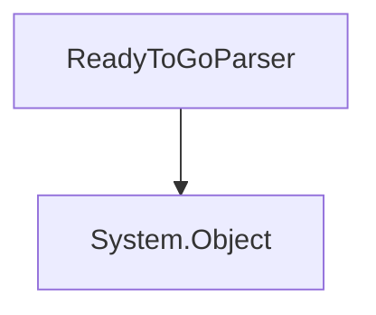

# `#!c# RSML.Parser.ReadyToGoParser` Static Class
Ready-to-go parsers that follow the most common RSML standards and are recommended for beginners and for greater compatibility.

<!-- HIERARCHY -->

## Hierarchy

---

<!-- STATIC METHODS -->

## Static Methods
`ReadyToGoParser` contains 3 static _(non-factory)_ methods.

### `#!c# CreateMFRoadLike(System.String rsmlContent)`
Creates a new ready-to-go RSML following the [`roadlike` Language Standard](../../../../language/standards/roadlike.md).

#### Parameters
`#!c# System.String rsmlContent`

:   The RSML document, as a `System.String`.

#### Returns
[**`RSParser`**](RSParser.md) : The RSML parser.

### `#!c# CreateNew(System.String rsmlContent)`
Creates a new ready-to-go RSML parser following the [`official-25` Language Standard](../../../../language/standards/official-25.md).

#### Parameters
`#!c# System.String rsmlContent`

:   The RSML document, as a `System.String`.

#### Returns
[**`RSParser`**](RSParser.md) : The RSML parser.

### `#!c# CreateNewFromFilepath(System.String filepath)`
Creates a new ready-to-go RSML parser from a file, following the [`official-25` Language Standard](../../../../language/standards/official-25.md).

#### Parameters
`#!c# System.String filepath`

:   The path to the file.

#### Returns
[`RSParser`](RSParser.md)

:   The RSML parser.

`#!c# null`

:   The specified file does not exist.
