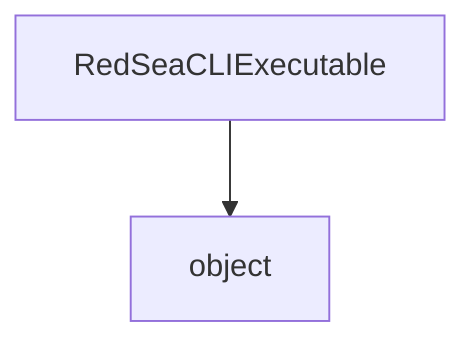

# `#!python RedSeaCLIExecutable` Class
Represents a [`RSML.CLI`](../../cli/index.md) executable.

<!-- HIERARCHY -->

## Hierarchy

---

<!-- CONSTRUCTORS -->

## Constructor
**`#!python RedSeaCLIExecutable.__init__(path_to_executable: str | None = None)`**

Creates a new executable given a path. If a path isn't given at this stage, it may **not** be given later.

#### Parameters
`#!python path_to_executable (str) = None`

:   The path to the executable, defaults to `#!python None`.

---

<!-- INSTANCE METHODS -->

## Instance Methods
`RedSeaCLIExecutable` contains 4 instance methods.

### `#!python evaluate_document(custom_rid: str | None = None, primary_only: bool = False, fallbacks: tuple[str | None, str] = (None, "[WARNING] No match was found."), expand_any: bool = False)`
Evaluates a document, using the [`official-25` Language Standard](../../language/standards/official-25.md).

#### Parameters
`#!python custom_rid (str | None) = None`

:   A custom RID to pass to the parser, instead of the host's RID. If set to `#!python None`, uses the host's RID.

`#!python primary_only (bool) = False`

:   If set to `#!python True`, only executes the primary operator.

`#!python fallbacks (tuple[str | None, str]) = (None, "[WARNING] No match was found.")`

:   The error and null message fallbacks, respectively. Defaults to `RSML.CLI`'s messages

`#!python expand_any (bool) = False`

:   If set to `#!python True`, expands `any` into Regex expression `.+`, indicating that any RID will be a match.

#### Exceptions
`ValueError`

:   The executable was not loaded.

#### Returns
`str`

:   The match (if any) **or** one of the specified fallbacks.

### `#!python evaluate_document_as_mfroad()`
Evaluates a document, using the [`roadlike` Language Standard](../../language/standards/roadlike.md).

#### Exceptions
`ValueError`

:   The executable was not loaded.

#### Returns
`str`

:   The match (if any) **or** one of the CLI's fallbacks.

### `#!python get_runtime_id()`
Retrieves the host's RID.

#### Exceptions
`ValueError`

:   The executable was not loaded.

#### Returns
`str`

:   The host's RID.

### `#!python load_document(document: RedSeaDocument)`
Loads a document into the executable.

#### Parameters
[`#!python document (RedSeaDocument)`](RedSeaDocument.md)

:   The document to load.

#### Exceptions
`ValueError`

:   The executable was not loaded.

#### Returns
`str`

:   The host's RID.

<!-- PROPERTIES -->

---

## Properties
`RedSeaCLIExecutable` contains 3 properties.

### `#!python repository -> str`
Returns the link to RSML's repository _(https://github.com/OceanApocalypseStudios/RedSeaMarkupLanguage)_.

#### Exceptions
`ValueError`

:   The executable was not loaded.

### `#!python repository_python -> str`
Returns the link to the module's repository _(https://github.com/OceanApocalypseStudios/RSML.Python)_.

### `#!python version -> str`
Returns the parser's version - not the CLI's version and not the module's version.

The returned string is in `vX.X.X` format.

#### Exceptions
`ValueError`

:   The executable was not loaded.
