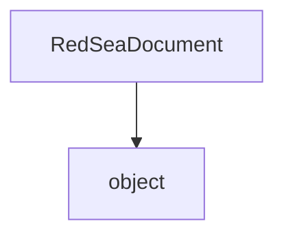

# `#!python RedSeaDocument` Class
Represents a **Red Sea Markup Language** document.

<!-- HIERARCHY -->

## Hierarchy

---

<!-- CONSTRUCTORS -->

## Constructor
**`#!python RedSeaDocument.__init__()`**

Creates a new empty document.

---

<!-- INSTANCE METHODS -->

## Instance Methods
`RedSeaDocument` contains 5 instance methods.

### `#!python get_document_data()`
Returns the loaded data.

#### Returns
`str`

:   The document's data.

### `#!python load_from_file(filepath: str, encoding: str = 'utf-8')`
Loads a document from a file at a given filepath.

#### Parameters
`#!python filepath (str)`

:   The file to load RSML data from.

`#!python encoding (str) = 'utf-8'`

:   The encoding to open the file with, defaults to `utf-8`.

### `#!python load_from_string(data: str)`
Loads a document from a string containing RSML.

#### Parameters
`#!python data (str)`

:   The string containing RSML data to load.

### `#!python write_document_to_file(filepath: str, encoding: str = 'utf-8')`
Writes the loaded data to a file.

#### Parameters
`#!python filepath (str)`

:   The file to write RSML data to.

`#!python encoding (str) = 'utf-8'`

:   The encoding to open the file with, defaults to `utf-8`.

### `#!python write_document_to_new_list()`
Writes the loaded document to a list.

#### Returns
`list[str]`

:   A list of strings, where each string is a line of loaded RSML.
