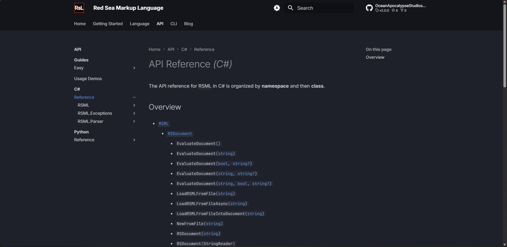
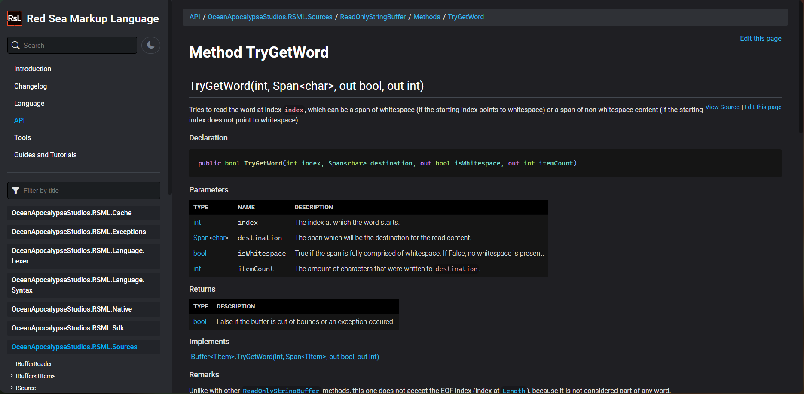

# Hello, DocFX!
> [!ARTICLE]
> Written by [Matthew](https://github.com/mf366-dev) at [OceanApocalypseStudios](https://github.com/OceanApocalypseStudios) on July 10, 2026.
> It will take about 1:57 to read this article at 220 WPM _(average reading speed)_.

This is the very first blog article to be available to the public in RSML's site. Those who have followed the development of this project certainly have noticed the site is looking _somewhat_ different. Well, you're clearly not wrong!

Today marks the day we, at OceanApocalypseStudios, have officially ditched [mkdocs](https://www.mkdocs.org) for [DocFX](https://dotnet.github.io/docfx/). Throughout this article, we'll be focusing on what aspects of Red Sea Markup Language lead to this decision and what it affects.

## Why change?
The main reason for the change was convenience. We're a small team and, because of that, it takes some time to release the projects and it also takes time to write documentation for them, such as guides and walkthroughs, as well as some minor articles for those following RSML's development.

Back when we were using mkdocs, we needed to manually create the API reference: it was not fun. We ended up having the [XML documentation](https://learn.microsoft.com/en-us/dotnet/csharp/language-reference/xmldoc/) in the source code and then we had to essentially port it manually to Markdown --- it felt like a huge waste of time that could have been put into creating walkthroughs or expanding RSML's online presence.

DocFX, unlike mkdocs, is made **for** .NET primarily, so it automatically creates API references from the source projects, allowing us to focus on the more important tasks, which are the ones that require manual and granular control.

We want to clarify we are not saying mkdocs is not great: it is! However, for our case (a .NET library with XML comments), there was a better alternative, one that reads those very same XML comments and, using the built DLL, generates meaningful documentation from that.

^^^

^^^ The old and new RSML websites, side-by-side

## Is the site fully finished?
Nowhere near finished :upside_down_face:

We are still working on v3.0.0-prerelease1, which means the site will also be updated frequently with new documentation, guides and whatnot. Even if we pretend for a second no more documentation will be added (which is unthinkable, as the site still has pages marked with "TODO"), we will change some aspects of the site's design.

---

We, at OceanApocalypseStudios, are constantly working on both new and existing projects: we've released [MurkyMarshParser](https://oceanapocalypsestudios.org/MurkyMarshParser/) to the public very recently and are now focused on crafting the biggest RSML release so far, little by little.

The move from mkdocs to DocFX has proved to complete a lot of tasks that were previously ours to get done, giving us time to focus on what truly matters.
